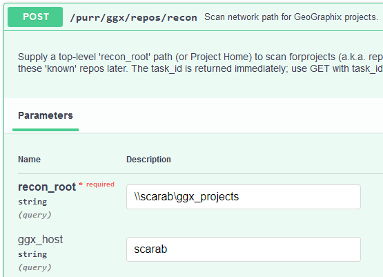

# purr_geographix

|  | 
|:--:|:--:|

---

Use **purr_geographix** to locate and query any GeoGraphix project* with 
minimal setup via a simple Python API. It's the missing middleware
[API](https://rbhughes.github.io/purr_geographix/) for taming an unruly
geoscience data environment.

* #### Dynamic discovery and query of projects (even lost, unshared)
* #### Simple Python API
* #### No license checkouts
* #### Well-centric exports to JSON:

```
- completion
- core
- dst
- formation
- ip
- perforation
- production
- raster_log
- survey
- vector_log
- well
- zone
```

* _Each [GeoGraphix](https://www.gverse.com/) "project" is a semi-structured collection of E&P assets that interoperate with its own
  [SQLAnywhere](https://www.sap.com/products/technology-platform/sql-anywhere.html)
  database. From an IT perspective, GeoGraphix is a distributed collection of
  user-managed databases "on the network" containing millions of assets._


## QUICKSTART 

1. `pip install purr_geographix`
2. launch console "as Administrator" and run `prep-purr-geographix`
3. `start-purr-geographix`
4. visit `http://localhost:8060/docs` for auto-generated docs


## DETAILED INSTALL/CONFIG


**PREREQUISITE**: You'll need a SQLAnywhere database server instance. The best
approach is to install **purr_geographix** on a PC that already has GeoGraphix.
Technically, you could use the SQLAnywhere client from
[SAP](https://help.sap.com/docs/SAP_SQL_Anywhere), but you'll still need a 
valid database _server_ someplace. Contact me if you need help.


### install

Using Python >3.10...
_(and it should go without saying, this is a Windows-only package)_

(optional) Define a virtual environment (venv), then:

`pip install purr_geographix`
or
`poetry add purr_geographix`


### prepare

Repo metadata collection uses the [DU](https://learn.microsoft.com/en-us/sysinternals/downloads/du) Disk Usage utility for performance. The following 
script will register the DU utility and tacitly accept its terms of use.

Register the driver and du using these steps:

1. launch an admin console (right-click Command Prompt | Run as administrator)
2. cd to the install location, activate your virtual environment
3. `prep-purr-geographix`
4. close the admin console


### configure

You can optionally define environment variables to modify some API behaviors. 
If the PC isn't running other services you probably don't have to define/change 
any of these:

| variable | default | description 
|:--|:--|:--|
| PURR_GEOGRAPHIX_PORT | 8060 | TCP port number used by the API
| PURR_GEOGRAPHIX_HOST | 0.0.0.0 | the default "localhost"
| PURR_GEOGRAPHIX_WORKERS | 4 | can increase if CPU supports it
| PURR_LOG_LEVEL | INFO |  options: CRITICAL, ERROR, WARNING, INFO, DEBUG

Some other files get written to your install location:
* SQLite database: `purr_geographix.sqlite`
* log file: `purr_geographix.log`


### launch

Launch the API via its preinstalled script
1. cd to the install location (a non-admin console is fine)
2. `start-purr-geographix`

The first time you launch the API, Windows Firewall may whine about Python.
Enable "Private networks" and Allow Access:


**purr_geographix** uses [FastAPI](https://fastapi.tiangolo.com "FastAPI").
You can test-drive your local API at either: 

`http://localhost:8060/docs` 
or
`http://localhost:8060/doc` 


## USAGE

#### 1. Do a POST `/purr/ggx/repos/recon` with a network path and server hostname

The path can be a top-level container of GeoGraphix projects (i.e. a Project 
Home) or just a project itself. Include the server hostname
NOTE: _We use the term **repo** and **project** interchangeably_



or

```
curl -X 'POST' \
'http://localhost:8000/purr/ggx/repos/recon?recon_root=%5C%5Cscarab%5Cggx_projects&ggx_host=scarab' \
-H 'accept: application/json' \
-d ''
```

_(Replace single quotes with double-quote for Windows)_

This might take a few minutes, so you get a `202 Reponse` containing a task id 
and task_status:

```
{
  "id": "d0ce171c-3f0f-4b37-953b-fe9df2f14bd1",
  "recon_root": "\\\\scarab\\ggx_projects\\",
  "ggx_host": "scarab",
  "task_status": "pending"
}
```

Metadata for each [repo](./docs/colorado_north.json) is stored in a local 
(sqlite) database.

#### 2. Use the task id to check status with a GET to `/purr/ggx/repos/recon/{task_id}`

```
{
  "id": "d0ce171c-3f0f-4b37-953b-fe9df2f14bd1",
  "recon_root": "\\\\scarab\\ggx_projects\\",
  "ggx_host": "scarab",
  "task_status": "completed"
}
```

Possible status values are: `pending`, `in_progress`, `completed`, or `failed`.

#### 3. Use the `repo_id` to query asset data in a repo. Add a UWI filter to search for specific well identifiers.


This can also be time-consuming, so it returns a `202 Response` with a task id and the
pending export file.

```
{
  "id": "f1de6c36-5693-4cbb-a4a1-9327af501ca1",
  "task_status": "pending",
  "task_message": "export file (pending): col_7159c5_1721489912_completion.json"
}
```

#### 4. Check asset export with a GET to /purr/ggx/asset/{repo_id}/{asset}

Like `repo/recon`, this returns a tast_status and task_message containing exported file
info.

```
{
"id": "f1de6c36-5693-4cbb-a4a1-9327af501ca1",
"task_status": "completed",
"task_message": "Exported 72 docs to: C:\\temp\\col_7159c5_1721489912_completion.json"
}
```

All asset data is exported as a "flattened" JSON representation of the original
relational model. Here's a [survey](./docs/survey.json) example.


## FUTURE 

Let me know whatever you might want to see in a future release. Some ideas are:

* Better query logic: match terms with `AND` instead of `SIMILAR TO` (`OR`)
* Structured ASCII (Petra PPF or GeoGraphix ASCII3) exports instead of JSON
* Full Text Search
* Datum-shift and standardize on EPSG:4326 for polygon hull points
* Auto-sync with your PPDM or OSDU store?
* Standardize a multi-project interface with Spotfire

## LICENSE

```
MIT License

Copyright (c) 2024 Bryan Hughes

Permission is hereby granted, free of charge, to any person obtaining a copy
of this software and associated documentation files (the "Software"), to deal
in the Software without restriction, including without limitation the rights
to use, copy, modify, merge, publish, distribute, sublicense, and/or sell
copies of the Software, and to permit persons to whom the Software is
furnished to do so, subject to the following conditions:

The above copyright notice and this permission notice shall be included in all
copies or substantial portions of the Software.

THE SOFTWARE IS PROVIDED "AS IS", WITHOUT WARRANTY OF ANY KIND, EXPRESS OR
IMPLIED, INCLUDING BUT NOT LIMITED TO THE WARRANTIES OF MERCHANTABILITY,
FITNESS FOR A PARTICULAR PURPOSE AND NONINFRINGEMENT. IN NO EVENT SHALL THE
AUTHORS OR COPYRIGHT HOLDERS BE LIABLE FOR ANY CLAIM, DAMAGES OR OTHER
LIABILITY, WHETHER IN AN ACTION OF CONTRACT, TORT OR OTHERWISE, ARISING FROM,
OUT OF OR IN CONNECTION WITH THE SOFTWARE OR THE USE OR OTHER DEALINGS IN THE
SOFTWARE.
```